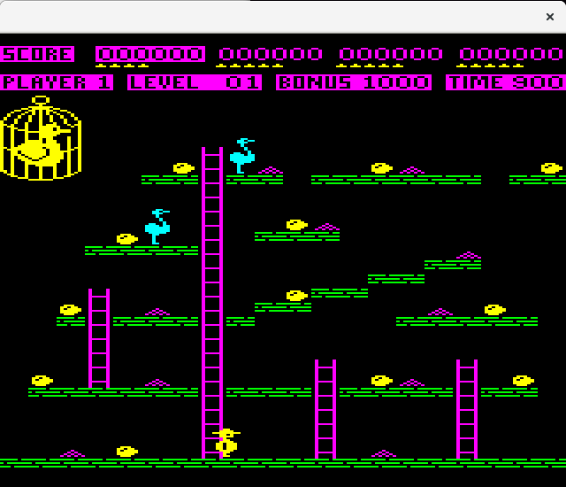

# container-ch-egg

An example container based version of the classic BBC Micro game Chuckie Egg. The game can be run locally or using the X11 protocol.

Run the container via the Cloud (via X11) or locally on your machine.

# Chuckie Egg
Source Code made available by [Mark Lomas](http://marklomas.net/ch-egg/native/native.htm)

# Dockerfile
Uses a standard Ubuntu 16.04 image with sound config. 

# Audio Configuration
Reference asound.conf

# To Build

To build, use the standard configuration and apply a version to image. For example to build an image named ch-egg and apply the version 1.0 do the following:

docker build -t ch-egg:1.0 .

# To Run

The following is the example of how to use the X11 protocol to run the container. 

docker run --rm -d -e DISPLAY=$DISPLAY -v /tmp/.X11-unix:/tmp/.X11-unix --hostname=$HOSTNAME -v $HOME/.Xauthority:/root/.Xauthority --device /dev/snd ch-egg:1.0 

If you intend to run the container on a Cloud Environment such as Google Cloud Platform, run the container remotely in the cloud and then from your local host tunnel the X11 protocol over SSH, e.g.

gcloud compute ssh android-studio-vm --zone us-central1-a --command "..."

# Cloud Run Button

